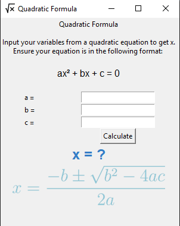
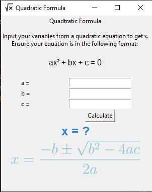
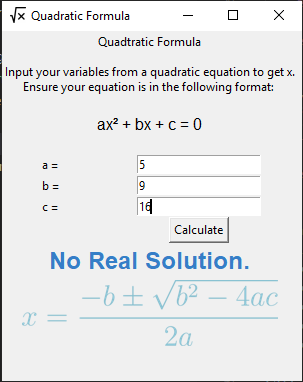
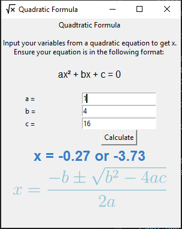

<div align="center"></div>

# Quadratic Formula Tkinter

Solves the quadratic formula.

## Dependencies
- tkinter
- pillow

<details>

On most distributions, you need only install tkinter:

- Alpine: `sudo apk add python3-tkinter`
- Fedora: `sudo dnf install python3-tkinter`

</details>

## Usage
<!-- Flatpak my beloved, but alas... windows >:( -->
```bash
git clone https://github.com/asparkswghs/tkinter-gui.git
cd tkinter-gui
python main.py
```

## Screenshot


<!--Shows misspelled part of UI:    -->
